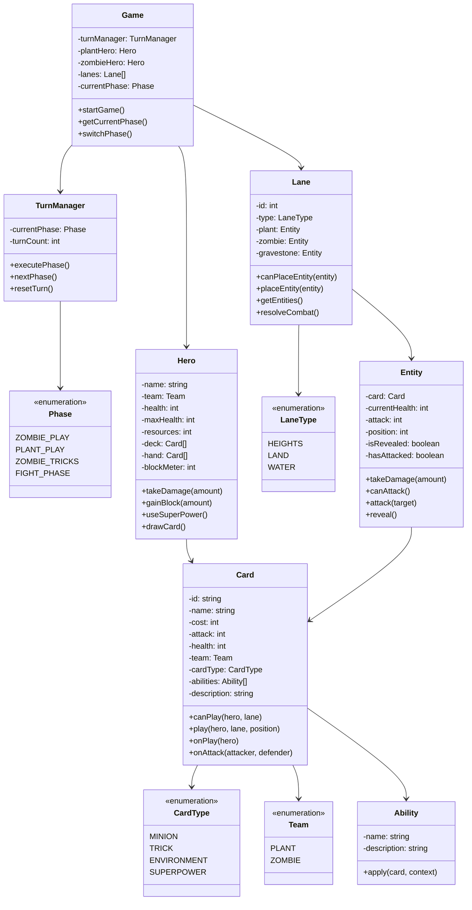

# 植物大战僵尸：英雄 - 核心架构设计

## 🎯 项目需求分析

### 核心战斗流程 (State Machine)
严格按照以下顺序实现回合循环：

1. **ZOMBIE_PLAY**: 僵尸方消耗"脑子"放置随从（随从可能是"墓碑"状态）
2. **PLANT_PLAY**: 植物方消耗"阳光"放置植物或使用法术
3. **ZOMBIE_TRICKS**: 僵尸方使用"锦囊（法术）"，同时所有"墓碑"僵尸在此阶段揭晓
4. **FIGHT_PHASE**: 从左到右（Lane 1 to 5）依次结算伤害

### 地图与UI布局
- **战道系统**: 5条独立战道
- **地形类型**: 1条高地(Heights)、3条陆地、1条水路(Water)
- **资源系统**: 植物用阳光，僵尸用脑子
- **英雄HP**: 双方20点
- **格挡表**: 受击时增加1-3格，攒满8格触发"超级格挡"

### 英雄与初始卡牌库

#### 植物英雄：绿影 (Green Shadow)
- **核心词条**: 团队协作（Team-Up）、反击、多线攻击
- **代表卡**: 豌豆射手(基础)、三线射手(攻击三路)、黑眼豌豆(当僵尸使用锦囊时获得+1/+1)
- **大招**: 在中间战道造成5点伤害

#### 僵尸英雄：超级脑袋 (Super Brainz)
- **核心词条**: 反英雄(Anti-Hero)、墓碑(Gravestone)、额外攻击
- **代表卡**: 迷你忍者(反英雄2)、电工僵尸(墓碑/揭晓时使一个僵尸额外攻击)
- **大招**: 移动一个僵尸并使其进行一次额外攻击

## 🏗️ 类图架构



## 📋 数据结构设计

### Card Schema
```javascript
{
    id: 'peashooter',
    name: '豌豆射手',
    cost: 1,
    attack: 2,
    health: 3,
    team: 'PLANT',
    cardType: 'MINION',
    abilities: ['TEAM_UP'],
    description: '基础攻击植物',
    laneRestrictions: [], // 空数组表示可在任何战道
    isAmphibious: false // 是否两栖
}
```

### Hero Schema
```javascript
{
    name: 'Green Shadow',
    team: 'PLANT',
    health: 20,
    maxHealth: 20,
    resources: 1, // 阳光
    blockMeter: 0,
    superPower: {
        name: '精准射击',
        cost: 0,
        description: '在中间战道造成5点伤害',
        effect: 'deal_damage_to_lane'
    }
}
```

### Lane Schema
```javascript
{
    id: 3, // 1-5
    type: 'HEIGHTS', // HEIGHTS, LAND, WATER
    plant: null,
    zombie: null,
    gravestone: null,
    hasHeightBonus: false // 高地战道特殊效果
}
```

## 🎮 核心游戏逻辑

### 回合循环实现
```javascript
class TurnManager {
    executePhase() {
        switch(this.currentPhase) {
            case Phase.ZOMBIE_PLAY:
                this.executeZombiePlayPhase();
                break;
            case Phase.PLANT_PLAY:
                this.executePlantPlayPhase();
                break;
            case Phase.ZOMBIE_TRICKS:
                this.executeZombieTricksPhase();
                break;
            case Phase.FIGHT_PHASE:
                this.executeFightPhase();
                break;
        }
        this.nextPhase();
    }
}
```

### 战斗结算逻辑
```javascript
function resolveCombat(lanes) {
    // 从左到右依次结算 (Lane 1 to 5)
    for (let lane of lanes) {
        const entities = lane.getEntities();
        if (entities.plant && entities.zombie) {
            // 双方都有单位，互相攻击
            resolveAttack(entities.plant, entities.zombie);
        } else if (entities.plant) {
            // 只有植物，攻击僵尸英雄
            attackHero(entities.plant, zombieHero);
        } else if (entities.zombie) {
            // 只有僵尸，攻击植物英雄
            attackHero(entities.zombie, plantHero);
        }
    }
}
```

## 🎯 开发任务清单

### 第一阶段：核心架构
1. ✅ 建立数据结构：Card, Entity, Hero, Lane类
2. ✅ 实现状态机：TurnManager处理四个阶段
3. ✅ 编写战斗逻辑：从左往右结算，处理反英雄和格挡
4. ✅ UI框架：竖屏布局，上方僵尸，下方植物，中间5条战道

### 第二阶段：卡牌实现
1. 实现绿影英雄卡牌库
2. 实现超级脑袋英雄卡牌库
3. 实现特殊能力逻辑
4. 实现超级技能系统

### 第三阶段：UI完善
1. 创建竖屏游戏界面
2. 实现卡牌拖拽系统
3. 实现动画效果
4. 实现音效和特效

### 第四阶段：平衡调整
1. 卡牌数值平衡
2. AI对手实现
3. 游戏测试和优化
4. 性能优化

## 🚀 下一步实现

基于以上架构，我将创建：
1. 核心类定义 (Card, Entity, Hero, Lane)
2. 状态机管理 (TurnManager)
3. 基础UI框架
4. 初始卡牌数据
